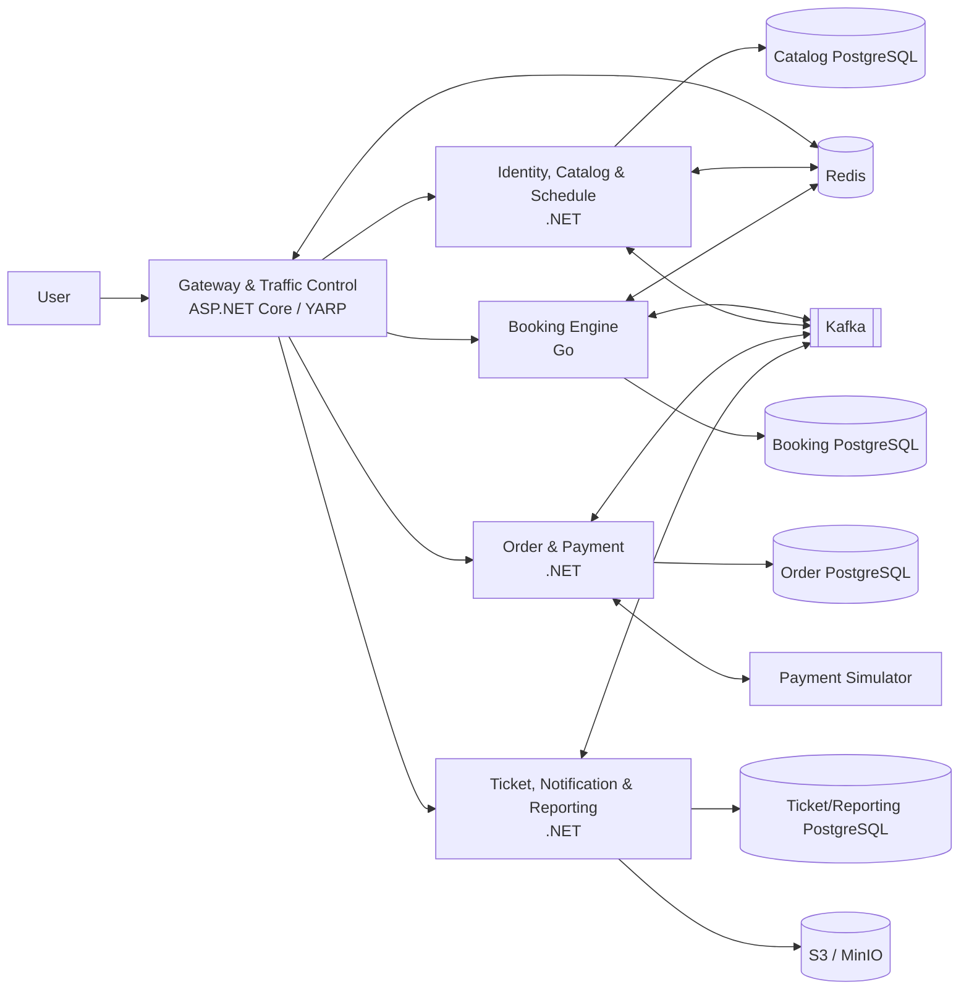
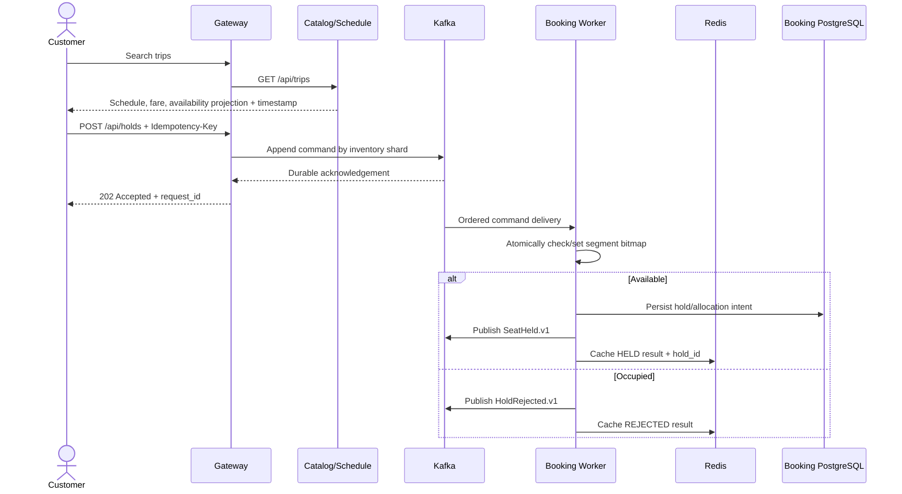
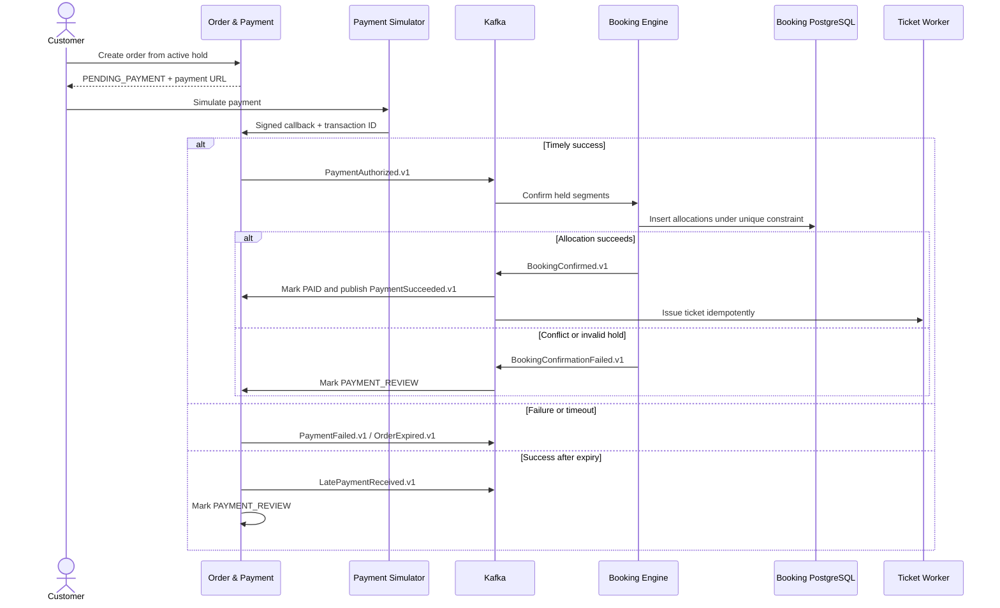
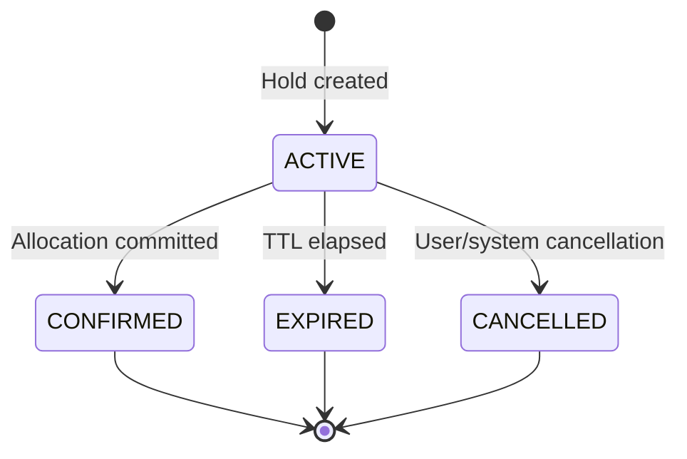
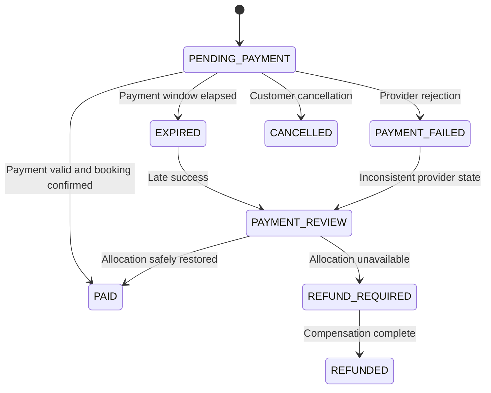
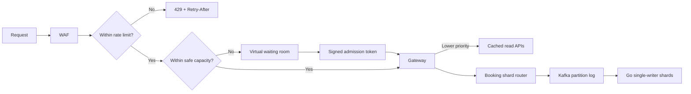

# TetRail Architecture

## 1. Architectural goals

- Prevent overlapping confirmed allocations for the same seat and journey segment.
- Allow a seat to be resold on non-overlapping segments.
- Return `202 Accepted` quickly after a booking command is durably recorded and process the result asynchronously.
- Protect booking writes during extreme load; schedule and seat-map reads may slow down or return timestamped stale projections.
- Keep payment, PDF generation, notification, and reporting off the booking critical path.
- Limit the MVP to five core deployables.
- Use Go only for the Booking Engine hot path and .NET for the other four services.

## 2. System architecture



### Data ownership principles

- Each service owns its schema/database logic; no service reads another service's tables directly.
- Synchronous integration uses versioned HTTP contracts. Business integration uses versioned Kafka events.
- Outbox/inbox protects event publication and supports duplicate-safe consumption.
- Booking commands are routed by inventory shard; each partition has one logical writer at a time.
- Redis contains ephemeral cache, idempotency/results, projections, and snapshots. PostgreSQL constraints are the final confirmed-allocation barrier.

## 3. Service responsibilities

| Service | Runtime | Main responsibilities | Owned data |
|---|---|---|---|
| Gateway & Traffic Control | .NET / ASP.NET Core / YARP | Routing, JWT validation, rate limiting, waiting room, correlation IDs | Expiring queue/admission state |
| Identity, Catalog & Schedule | .NET / ASP.NET Core | Users, passengers, stations, routes, trips, carriages, seats, fares, search | Identity, catalog, schedules, fares |
| Booking Engine | Go | Durable command routing, shard single writers, hold/expire/confirm by segment | Shard state/snapshots, holds, confirmed allocations |
| Order & Payment | .NET / ASP.NET Core | Order state machine, snapshots, payment attempts, webhooks | Orders, order items, payment attempts |
| Ticket, Notification & Reporting | .NET + workers | QR/PDF, notifications, reporting read models | Tickets, delivery logs, reporting projections |

### Booking Engine technology boundary

The Booking Engine exposes language-neutral HTTP and event contracts; .NET services do not share domain assemblies with it.

- HTTP: lightweight Go routing, versioned OpenAPI, and `202` only after durable append.
- Kafka: idempotent producer, partition consumers, backpressure, and lag metrics.
- Inventory: in-memory bitmap/state machine restored from snapshots plus Kafka replay.
- Redis: idempotency, request-result cache, projection, and snapshots; no global distributed lock for all booking.
- PostgreSQL: `pgxpool`, partition-aware routing, and batched confirmed segment allocation.
- Concurrency: bounded goroutines, deadlines, bounded pools, and backpressure.
- Observability: W3C-compatible OpenTelemetry, Prometheus metrics, and structured logs.

Go reduces hot-path allocation/overhead, but performance claims require benchmarks and distributed load tests. Correctness still depends on partition ordering, idempotency, and PostgreSQL constraints.

## 4. Segment-based seat model

A route with ten stations contains nine occupancy segments. Journey intervals use the half-open convention `[from_stop_order, to_stop_order)`.

```text
Stations:             1     2     3     4     5     6
Segments:                1→2   2→3   3→4   4→5   5→6

Booking X: 1 → 3      [===========)
Booking Y: 3 → 5                  [===========)    valid
Booking Z: 2 → 4            [===========)          conflicts with X and Y
```

Two allocations conflict when:

```text
new_from < existing_to AND existing_from < new_to
```

Inventory uses a stable shard key so a hot trip can span multiple partitions:

```text
inventory_shard = hash(trip_id, carriage_id or seat_bucket)
```

A seat is represented by segment bits. Holding seat `A01` from station 1 to 3 atomically checks and sets:

```text
(T2027-001, A01, segment 1)
(T2027-001, A01, segment 2)
```

Kafka orders commands within a partition, and a consumer group gives one logical owner to that partition. PostgreSQL stores confirmed occupancy per segment with a final constraint:

```sql
UNIQUE (trip_id, seat_id, segment_index)
```

Same-shard multi-seat commands are all-or-nothing. Cross-shard selection uses a reservation saga: each shard creates a provisional hold, the coordinator commits only when all succeed, and failures trigger compensation.

## 5. Search and hold flow



Consistency rules:

- Seat maps and search availability are eventually consistent read projections.
- `202 Accepted` means only that the command was durably recorded.
- Only `HELD` with `hold_id` and `expires_at` confirms a hold.
- Workers snapshot state and replay Kafka after restart or partition transfer.
- A worker never publishes success when confirmed-state persistence fails; it retries or compensates idempotently.

## 6. Order, payment, and ticket flow



Webhook callbacks are authenticated and deduplicated by `(provider, provider_transaction_id)`. Repeated callbacks cannot create duplicate charges, allocations, or tickets.

## 7. State machines

### Seat hold



### Order and payment



## 8. Peak traffic control



Waiting-room thresholds combine Kafka produce latency and skew, booking acknowledgement/completion lag, PostgreSQL saturation, Redis latency/memory pressure, active holds, and checkout throughput. Checkout users receive scoped continuity but remain subject to anti-spam limits.

The one-million-per-second target is measured at durable Kafka acknowledgement. WAF/rate-limited requests do not count. Reports disclose burst duration, partition count, replication, payload size, hot-key distribution, accepted/rejected ratio, and queue-drain time.

## 9. Deployment characteristics

- Gateway and .NET services are stateless and scale horizontally.
- Go workers hold partition state in memory and restore it through snapshots plus Kafka replay.
- Consumer-group generation/epoch fences stale partition owners.
- Database, Kafka, and Redis concurrency is bounded so autoscaling cannot overwhelm stateful dependencies.
- Each deployable exports traces, metrics, and structured logs to the shared observability platform.

## 10. Failure handling

| Scenario | Handling |
|---|---|
| Client retries a hold/order | Idempotency returns the same logical result. |
| Redis unavailable | Durable paths continue where possible; cache/result reads degrade or rebuild. |
| Kafka cannot meet durability | Do not return accepted; fail closed or use the waiting room. |
| PostgreSQL shard failure | Stop publishing success; retry/buffer within bounds and apply backpressure. |
| Duplicate event delivery | Inbox/deduplication and unique business keys. |
| Kafka rebalance | Snapshot + replay; epoch fencing prevents two owners. |
| Hot/skewed partition | Shard-aware admission, seat buckets, and controlled rebalancing. |
| Worker dies during expiry | Idempotent claim/lease lets another worker continue. |
| Late payment success | Move to `PAYMENT_REVIEW`; do not issue a ticket automatically. |
| PDF/email failure | Retry and DLQ without rolling back payment/booking. |
| Stale seat projection | Hold processing always checks authoritative booking state. |

## 11. Observability and SLOs

Requests and events propagate correlation, causation, and W3C trace context.

- Gateway: request/rejection rates, waiting-room depth, and admission rate.
- Booking: durable acknowledgements/s, completion latency, partition lag/skew, conflicts, active/orphan holds, and constraint conflicts.
- Payment: successful, failed, late, and duplicate callbacks; order-state age.
- Messaging: produce latency, throughput, lag, rebalance, under-replicated partitions, retry, and DLQ depth.
- Data: PostgreSQL connections/locks/query latency and Redis latency/memory/evictions.

Initial SLOs:

- At least 1,000,000 durable booking acknowledgements per second across the cluster in a defined burst.
- Booking acknowledgement p99 below 200 ms; completion initially targets p99 below two seconds within admission limits.
- Search and seat-map reads are best effort under extreme booking load and always expose projection timestamps.
- Zero duplicate confirmed `(trip_id, seat_id, segment_index)` allocations.
- 99% of tickets issued within 30 seconds after booking confirmation.

## 12. Accepted architecture decisions

1. Seats may be resold on non-overlapping journey segments.
2. Occupancy is modeled per segment between consecutive stations.
3. Booking commands are partitioned by inventory shard and processed by Go logical single writers using bitmap state.
4. PostgreSQL unique constraints are the final overbooking barrier.
5. Kafka partition logs plus transactional outbox/inbox provide durable commands and domain events.
6. The payment simulator preserves a real-provider-style webhook contract.
7. Reporting uses a separate read model and never runs heavy queries on transactional paths.
8. Only the Booking Engine uses Go; the other four services use .NET.
9. `POST /holds` returns `202 Accepted`; clients obtain `HELD`/`REJECTED` through polling or SSE.
10. One million commands per second means durably acknowledged cluster-wide commands, not successful ticket sales.
